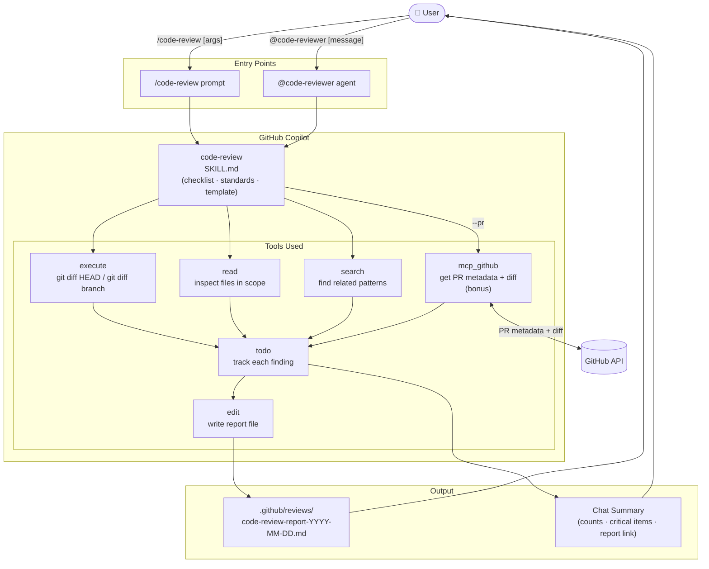

# Code Review — GitHub Copilot Feature

Comprehensive code review powered by GitHub Copilot. Analyzes code for security vulnerabilities, code quality issues, missing tests, performance problems, architectural concerns, and documentation gaps. Produces a prioritized markdown report and tracks findings with todo items.

---

## Architecture



---

## Files

| File | Purpose |
|---|---|
| `.github/agents/code-reviewer.agent.md` | Custom Copilot agent — the reviewer persona |
| `.github/prompts/code-review.prompt.md` | Prompt workflow — the review execution sequence |
| `.github/skills/code-review/SKILL.md` | Domain knowledge — checklist, standards, and report template |
| `.github/reviews/` | Output folder — generated report files |

---

## How to Use

### Option A: Run as a prompt (recommended)

Open Copilot Chat and type one of the following:

```
/code-review
```
Reviews all **uncommitted changes** (`git diff HEAD`).

```
/code-review src/main/java/com/example/UserService.java
```
Reviews a **specific file**.

```
/code-review src/main/java/com/example/*.java
```
Reviews **multiple files** matching a glob pattern.

```
/code-review --branch feature/my-feature
```
Reviews all changes on a **branch** compared to `main`.

```
/code-review --pr 42
```
Reviews an **open GitHub PR by number** — no local checkout needed (bonus, requires GitHub MCP server). Falls back to `git fetch` + `--branch` if MCP is unavailable.

---

### Option B: Invoke the agent directly

In Copilot Chat, mention `@code-reviewer`:

```
@code-reviewer review the uncommitted changes in the service layer
```

```
@code-reviewer check src/main/java/org/springframework/samples/petclinic/rest/controller/OwnerRestController.java for security issues
```

---

## What Happens During a Review

1. **Scope detection** — reads the diff or specified files.
2. **Checklist applied** across 6 areas:
   - Code Quality
   - Security
   - Testing
   - Performance
   - Architecture
   - Documentation
3. **Findings tracked** as `todo` items with severity prefix during the session.
4. **Report generated** — written to `.github/reviews/code-review-report-<YYYY-MM-DD>.md`.
5. **Summary presented** in chat — issue counts, critical items, and link to the report.

---

## Priority Levels

| Level | Label | Action |
|---|---|---|
| 🔴 | CRITICAL | Must fix before merge |
| 🟡 | IMPORTANT | Requires team discussion |
| 🟢 | SUGGESTION | Non-blocking improvement |

---

## Report Output

Reports are saved to `.github/reviews/` with the naming pattern:

```
.github/reviews/code-review-report-2026-03-24.md
```

Each report includes:
- **Executive Summary** — issue counts by priority
- **Issues by Priority** — file path, line numbers, description, impact, and suggested fix
- **Positive Observations** — good practices found
- **Recommendations** — high-level improvements
- **Next Steps** — ordered action list

---

## Bonus: Review a PR by Number (`--pr`)

`--pr <number>` uses the **GitHub MCP server** to fetch the PR diff remotely — no `git fetch` or local checkout required.

### Prerequisites

1. A GitHub MCP server must be configured in VS Code (e.g. via `.vscode/mcp.json` or user settings).
2. The server must expose: `mcp_github_get_pull_request`, `mcp_github_get_pull_request_files`, `mcp_github_get_pull_request_diff`.

### Fallback (no MCP)

If the GitHub MCP server is unavailable, run manually then use `--branch`:

```bash
git fetch origin feature/my-pr-branch
/code-review --branch feature/my-pr-branch
```

---

## Reference Files

- Review standards and checklist: [SKILL.md](SKILL.md)
- Agent definition: [code-reviewer.agent.md](../../agents/code-reviewer.agent.md)
- Prompt workflow: [code-review.prompt.md](../../prompts/code-review.prompt.md)
